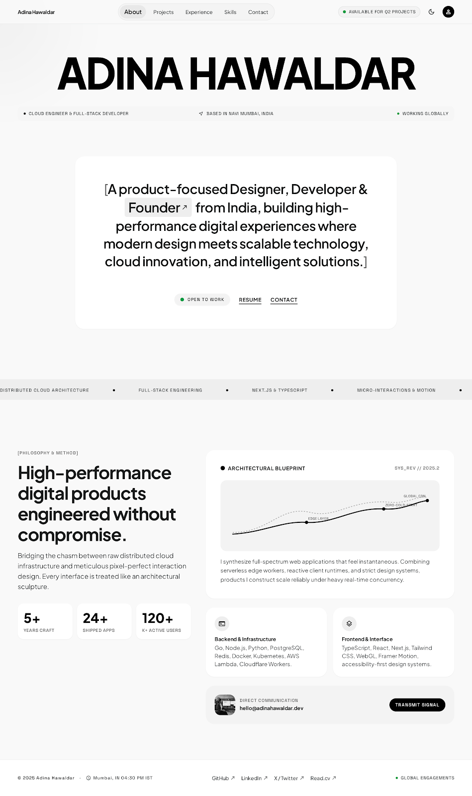

# Hriday Gupta — Personal Portfolio

> **Modern Editorial Minimalist** portfolio showcase website for **Hriday Gupta** — Final-Year B.Tech Computer Science (AI & ML) student at Sharda University, Full-Stack Developer, and AI Engineer.



---

## 🌟 Overview

This portfolio embodies an ultra-minimalist, gallery-grade digital presence built with high-contrast typography, interactive micro-interactions, 3D card tilt physics, and smooth reactive state management.

### Key Highlights
- **Monumental Editorial Typography**: Built with **Plus Jakarta Sans** and utilitarian **Space Grotesk**.
- **Interactive Project Showcase**:
  - Filterable categories (`ALL`, `[Full-Stack]`, `[AI & LLMs]`, `[Web Apps]`, `[Data Science]`).
  - Dynamic index counter (`INDEX: 05 DISPLAYED`).
  - 3D parallax tilt effects responding to cursor physics.
  - Interactive Lightbox modal displaying deep architectural specifications for each project.
- **Featured Projects**:
  - **MED-RUSSIA**: Full-stack consultancy & university guidance platform for Indian medical students in Russia.
  - **LLM Models & Fine-Tuning Hub**: Parameter-Efficient Fine-Tuning (PEFT/LoRA), quantization, and custom inference pipelines.
  - **Alligneye ML & Analytics Suite**: Real-world exploratory data analysis, data cleaning pipelines, and predictive models from industry internship.
  - **Editorial Animated Portfolio**: High-performance minimalist digital portfolio with 120fps motion.
  - **+13 Specialized Software Suite**: Comprehensive repository archive of web utilities and DSA implementations.
- **Dynamic Counters**: Live count-up animations triggered on viewport entry (16+ Projects, 400+ DSA, 2027 Cohort).
- **Theme Engine**: Seamless toggle between **Modern Editorial Light** and **Obsidian Dark** mode with `localStorage` persistence.
- **Ambient Lighting**: Dynamic mouse-following spotlight glow (`#ambient-glow`).
- **Direct Resume Access**: Direct view and download for `Hriday_Gupta_Resume.pdf`.
- **Live IST Clock**: Real-time Indian Standard Time clock in the footer.

---

## 🛠️ Tech Stack

- **Markup & Styling**: HTML5, Tailwind CSS, Google Fonts (Plus Jakarta Sans & Space Grotesk), Material Symbols
- **Scripting & Dynamics**: Modern Vanilla JavaScript (ES6+)
- **Design Paradigm**: Modern Editorial Minimalist / Swiss Typographic Grid

---

## 🚀 Quick Start / Local Setup

No build step or Node dependencies required. Simply open `index.html` in your browser or run a simple local HTTP server:

```bash
# Clone the repository
git clone https://github.com/hridaycode1119/Hriday-Gupta-Portfolio.git
cd Hriday-Gupta-Portfolio

# Run using Python's built-in HTTP server
python3 -m http.server 8000
```

Then visit [http://localhost:8000](http://localhost:8000) in your browser.

---

## 📬 Contact & Connect

- **Email**: [hriday.code1119@gmail.com](mailto:hriday.code1119@gmail.com)
- **Phone**: +91-7678107310
- **Location**: Noida Extension (Ace City), Delhi NCR, India
- **GitHub**: [@hridaycode1119](https://github.com/hridaycode1119)

---

© 2025 Hriday Gupta. Built with precision and care.
